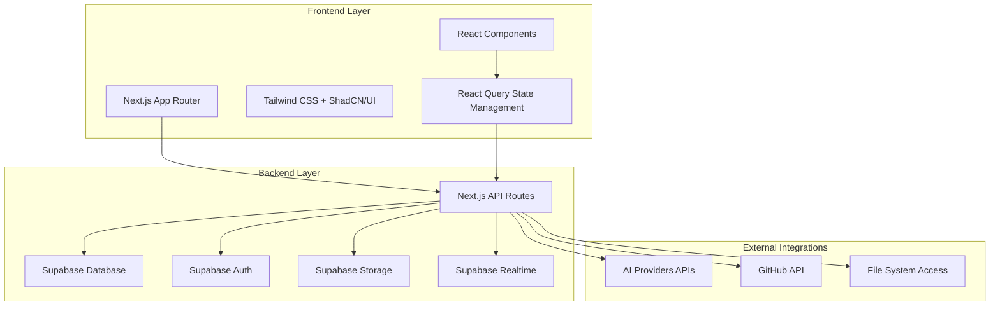
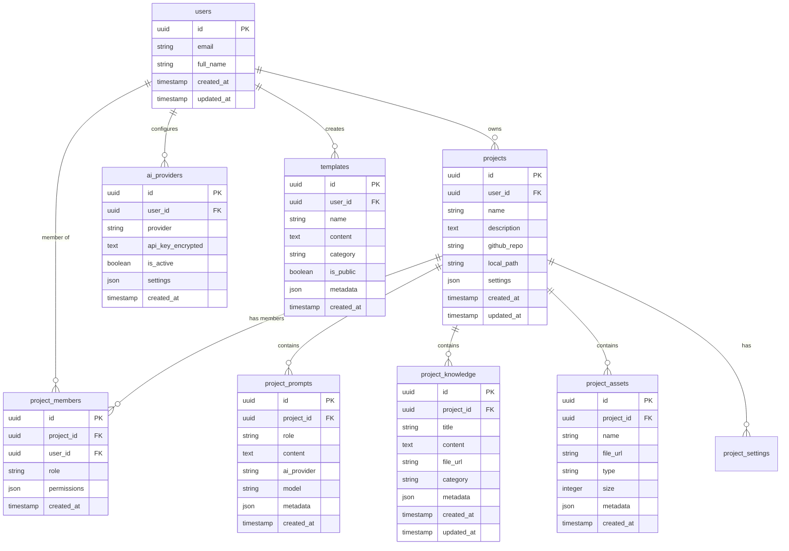

# VibeCraft Studio Design Document

## Overview

VibeCraft Studio is built as a modern web application using Next.js with Supabase backend, designed to provide project-based workspaces for non-coders building web applications. The architecture emphasizes modularity, real-time collaboration, and AI integration while maintaining security and scalability.

## Architecture

### High-Level Architecture



### Database Architecture

The database uses PostgreSQL through Supabase with Row-Level Security (RLS) for multi-tenant isolation:



## Components and Interfaces

### Frontend Component Structure

```
src/
├── app/                          # Next.js App Router
│   ├── (auth)/                   # Authentication routes
│   ├── dashboard/                # Main dashboard
│   ├── projects/[id]/            # Project workspace
│   └── api/                      # API routes
├── components/
│   ├── ui/                       # ShadCN/UI components
│   ├── layout/                   # Layout components
│   ├── project/                  # Project-specific components
│   ├── ai/                       # AI interaction components
│   └── collaboration/            # Real-time collaboration
├── lib/
│   ├── supabase/                 # Supabase client and utilities
│   ├── ai/                       # AI provider integrations
│   ├── github/                   # GitHub API integration
│   └── utils/                    # Utility functions
└── hooks/                        # Custom React hooks
```

### Key Component Interfaces

#### Project Workspace Component
```typescript
interface ProjectWorkspaceProps {
  projectId: string;
  initialData: Project;
  userRole: ProjectRole;
}

interface Project {
  id: string;
  name: string;
  description: string;
  githubRepo?: string;
  localPath?: string;
  settings: ProjectSettings;
  members: ProjectMember[];
  createdAt: Date;
  updatedAt: Date;
}
```

#### AI Chat Component
```typescript
interface AIChatProps {
  projectId: string;
  initialMessages: ChatMessage[];
  availableProviders: AIProvider[];
  projectContext: ProjectContext;
}

interface ChatMessage {
  id: string;
  role: 'user' | 'assistant';
  content: string;
  provider: string;
  model: string;
  metadata: MessageMetadata;
  createdAt: Date;
}
```

#### Knowledge Base Component
```typescript
interface KnowledgeBaseProps {
  projectId: string;
  documents: KnowledgeDocument[];
  assets: ProjectAsset[];
  onUpload: (files: File[]) => Promise<void>;
  onSearch: (query: string) => Promise<SearchResult[]>;
}
```

### API Route Structure

```
/api/
├── auth/                         # Authentication endpoints
├── projects/                     # Project CRUD operations
│   ├── [id]/
│   │   ├── prompts/             # Chat history management
│   │   ├── knowledge/           # Knowledge base operations
│   │   ├── assets/              # Asset management
│   │   └── members/             # Team collaboration
├── ai/                          # AI provider integrations
├── github/                      # GitHub API proxy
├── templates/                   # Template management
└── webhooks/                    # External service webhooks
```

## Data Models

### Core Data Models

#### Project Model
```typescript
interface Project {
  id: string;
  userId: string;
  name: string;
  description: string;
  githubRepo?: string;
  localPath?: string;
  settings: {
    defaultAIProvider: string;
    defaultModel: string;
    collaborationEnabled: boolean;
    publicTemplates: boolean;
  };
  createdAt: Date;
  updatedAt: Date;
}
```

#### AI Provider Configuration
```typescript
interface AIProvider {
  id: string;
  userId: string;
  provider: 'openai' | 'anthropic' | 'straico' | 'cohere';
  apiKeyEncrypted: string;
  isActive: boolean;
  settings: {
    defaultModel: string;
    maxTokens: number;
    temperature: number;
  };
}
```

#### Knowledge Document Model
```typescript
interface KnowledgeDocument {
  id: string;
  projectId: string;
  title: string;
  content: string;
  fileUrl?: string;
  category: 'documentation' | 'research' | 'assets' | 'code';
  metadata: {
    fileType?: string;
    size?: number;
    tags: string[];
  };
  createdAt: Date;
  updatedAt: Date;
}
```

### State Management Models

#### Project Context State
```typescript
interface ProjectContextState {
  currentProject: Project | null;
  chatHistory: ChatMessage[];
  knowledgeBase: KnowledgeDocument[];
  assets: ProjectAsset[];
  codeContext: CodeContext | null;
  collaborators: ProjectMember[];
  isLoading: boolean;
  error: string | null;
}
```

## Error Handling

### Error Classification

1. **Authentication Errors**: Invalid tokens, expired sessions
2. **Authorization Errors**: Insufficient permissions, project access denied
3. **Validation Errors**: Invalid input data, missing required fields
4. **External API Errors**: AI provider failures, GitHub API issues
5. **Database Errors**: Connection issues, constraint violations
6. **File System Errors**: Upload failures, storage quota exceeded

### Error Handling Strategy

```typescript
interface APIError {
  code: string;
  message: string;
  details?: any;
  timestamp: Date;
}

// Global error handler
class ErrorHandler {
  static handle(error: unknown): APIError {
    if (error instanceof ValidationError) {
      return {
        code: 'VALIDATION_ERROR',
        message: error.message,
        details: error.fields,
        timestamp: new Date()
      };
    }
    
    if (error instanceof AuthError) {
      return {
        code: 'AUTH_ERROR',
        message: 'Authentication required',
        timestamp: new Date()
      };
    }
    
    // Default error handling
    return {
      code: 'INTERNAL_ERROR',
      message: 'An unexpected error occurred',
      timestamp: new Date()
    };
  }
}
```

### Client-Side Error Boundaries

```typescript
interface ErrorBoundaryState {
  hasError: boolean;
  error: Error | null;
  errorInfo: ErrorInfo | null;
}

class ProjectErrorBoundary extends Component<Props, ErrorBoundaryState> {
  // Error boundary implementation for project workspace
  // Provides fallback UI and error reporting
}
```

## Testing Strategy

### Testing Pyramid

1. **Unit Tests (70%)**
   - Component testing with React Testing Library
   - Utility function testing with Jest
   - API route testing with supertest
   - Database model testing

2. **Integration Tests (20%)**
   - API endpoint integration testing
   - Database integration testing
   - External service integration testing
   - Real-time collaboration testing

3. **End-to-End Tests (10%)**
   - Critical user journey testing with Playwright
   - Cross-browser compatibility testing
   - Mobile responsiveness testing

### Test Structure

```
tests/
├── unit/
│   ├── components/              # Component unit tests
│   ├── lib/                     # Utility function tests
│   └── api/                     # API route tests
├── integration/
│   ├── database/                # Database integration tests
│   ├── external/                # External API tests
│   └── realtime/                # Real-time feature tests
└── e2e/
    ├── auth/                    # Authentication flows
    ├── projects/                # Project management flows
    └── collaboration/           # Team collaboration flows
```

### Testing Configuration

```typescript
// Jest configuration for unit and integration tests
const jestConfig = {
  testEnvironment: 'jsdom',
  setupFilesAfterEnv: ['<rootDir>/tests/setup.ts'],
  moduleNameMapping: {
    '^@/(.*)$': '<rootDir>/src/$1',
  },
  collectCoverageFrom: [
    'src/**/*.{ts,tsx}',
    '!src/**/*.d.ts',
    '!src/**/*.stories.{ts,tsx}',
  ],
  coverageThreshold: {
    global: {
      branches: 80,
      functions: 80,
      lines: 80,
      statements: 80,
    },
  },
};

// Playwright configuration for E2E tests
const playwrightConfig = {
  testDir: './tests/e2e',
  use: {
    baseURL: 'http://localhost:3000',
    trace: 'on-first-retry',
  },
  projects: [
    { name: 'chromium', use: { ...devices['Desktop Chrome'] } },
    { name: 'firefox', use: { ...devices['Desktop Firefox'] } },
    { name: 'webkit', use: { ...devices['Desktop Safari'] } },
    { name: 'mobile', use: { ...devices['iPhone 12'] } },
  ],
};
```

### Security Testing

- **Authentication Testing**: Token validation, session management
- **Authorization Testing**: Role-based access control, project isolation
- **Input Validation Testing**: SQL injection, XSS prevention
- **API Security Testing**: Rate limiting, CORS configuration
- **Data Encryption Testing**: API key encryption, sensitive data protection

### Performance Testing

- **Load Testing**: Concurrent user simulation
- **Database Performance**: Query optimization testing
- **Real-time Performance**: WebSocket connection testing
- **File Upload Performance**: Large file handling
- **AI API Performance**: Response time and rate limiting

### Accessibility Testing

- **Automated Testing**: axe-core integration
- **Manual Testing**: Screen reader compatibility
- **Keyboard Navigation**: Tab order and focus management
- **Color Contrast**: WCAG compliance verification
- **Mobile Accessibility**: Touch target sizing and gestures